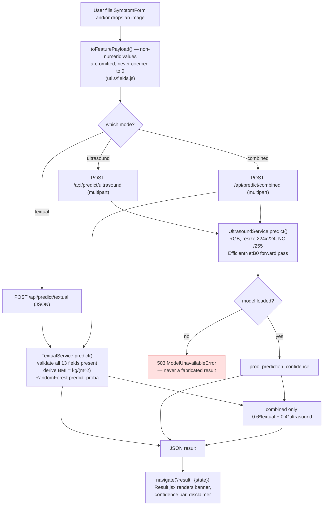
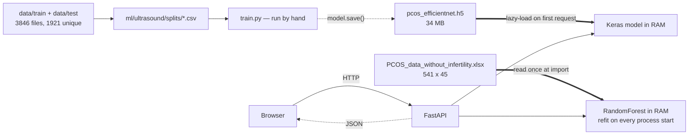

# 01 — Architecture

How the system is built and how a request flows through it. Every claim points at a file.

## Stack

| Layer | Technology | Entry point |
|---|---|---|
| Frontend | React 18 + Vite 5, React Router 6, plain CSS | [`frontend/src/main.jsx`](../frontend/src/main.jsx) |
| Backend | FastAPI + Uvicorn (async, no DB) | [`backend/app/main.py`](../backend/app/main.py) |
| Clinical model | scikit-learn `RandomForestClassifier` | [`textual_service.py`](../backend/app/services/textual_service.py) |
| Imaging model | TensorFlow 2.21 / Keras 3.15, EfficientNetB0 | [`ultrasound_service.py`](../backend/app/services/ultrasound_service.py) |
| Training | Offline scripts, run manually | [`ml/`](../ml) |

No database, no auth, no queue, no cache, no Docker, no CI. Persistence is two files on disk:
a `.xlsx` spreadsheet and a `.h5` model.

## Running it locally

```bash
# Backend  (from backend/)
python -m uvicorn app.main:app --port 8000

# Frontend (from frontend/)
npm install && npm run dev          # http://localhost:5173
```

The frontend finds the API in one of two ways, and they are mutually exclusive:

- **No `.env`** — `API` is `""`, so the browser calls `/api/...` and Vite's dev proxy forwards to
  `http://localhost:8000` ([`vite.config.js:6-13`](../frontend/vite.config.js#L6-L13)).
- **`.env` with `VITE_API_URL`** — the browser calls that absolute URL directly and the proxy is
  bypassed entirely. CORS is what makes this work, not the proxy.

`VITE_API_URL` is inlined at build time, so changing it needs a rebuild, not a restart.

## Routes

Frontend ([`main.jsx:17-24`](../frontend/src/main.jsx#L17-L24)) — 6 routes, no guards, no catch-all:
`/`, `/auth`, `/predict/textual`, `/predict/ultrasound`, `/predict/combined`, `/result`.

Backend — 4 routes:

| Method | Path | Handler |
|---|---|---|
| GET | `/` | [`main.py:35-51`](../backend/app/main.py#L35-L51) — reports `healthy` / `degraded` per model |
| POST | `/api/predict/textual` | [`api/textual.py`](../backend/app/api/textual.py) — JSON body |
| POST | `/api/predict/ultrasound` | [`api/ultrasound.py`](../backend/app/api/ultrasound.py) — multipart image |
| POST | `/api/predict/combined` | [`api/combined.py`](../backend/app/api/combined.py) — multipart, both |

FastAPI's `/docs` is enabled by default.

## Request flow



**Response shape** (all three modes):

```json
{ "success": true, "mode": "textual|ultrasound|combined",
  "prediction": 0, "label": "No PCOS", "confidence": 73.2, "pcos_probability": 26.8 }
```

Combined adds `breakdown.textual` and `breakdown.ultrasound`. Ultrasound adds `mock` and
`used_pixel_std_fallback`.

One subtlety worth knowing: `confidence` means different things per mode. The two single-mode
services report the predicted class probability (always 50-100). The combined route reports
`abs(p - 50) * 2`, i.e. distance from the decision boundary (0-100)
([`combined.py:53-54`](../backend/app/api/combined.py#L53-L54)). A 50.5% combined probability shows
as 1% confidence.

## State and data flow

Nothing a user submits is ever persisted. A submission exists only as React state, an HTTP body, a
Python object inside one handler, and `location.state` on `/result` — which is lost on refresh
([`Result.jsx:19-22`](../frontend/src/pages/Result.jsx#L19-L22) redirects home). There is no
database, no logging of inputs, no analytics, and no third-party transmission.



Solid double arrows are load-once-at-startup reads. Dotted arrows are manual steps — there is no
automation from training output to a running server.

## Startup behaviour

Everything expensive happens at **import time**, not in a lifespan event:

- [`textual_service.py`](../backend/app/services/textual_service.py) fits a 300-tree Random Forest
  when the module is imported. Every Uvicorn worker repeats it; nothing is cached to disk. If the
  spreadsheet is missing, the process will not start.
- [`ultrasound_service.py`](../backend/app/services/ultrasound_service.py) loads nothing at import.
  TensorFlow is first imported on the first ultrasound request, so that request is slow. A missing
  or unloadable `.h5` does not stop startup — it makes `GET /` report `degraded` and the two
  imaging routes return 503.

Both `predict()` calls are synchronous CPU work invoked from `async def` handlers, so they block
the event loop for the duration of inference. Fine at demo scale; it would need
`run_in_threadpool` under real traffic.

## Deployment

What actually exists in the repo: [`frontend/vercel.json`](../frontend/vercel.json), an SPA rewrite.
That is all. No Dockerfile, no CI, no `render.yaml`, no IaC.

The README describes a manual Render + Vercel setup (backend root `backend/`, start
`uvicorn app.main:app --host 0.0.0.0 --port $PORT`; frontend root `frontend/`, output `dist`).
Two things to know before deploying:

- `.gitignore` line 43 is a bare `*.h5`, so **the model is not tracked by git**. A git-based deploy
  ships a backend with no model, which now returns 503 rather than fake predictions.
- CORS is still `allow_origins=["*"]` ([`main.py:17-23`](../backend/app/main.py#L17-L23)). Set a real
  origin list before any public deployment.

## Known incomplete

[`/auth`](../frontend/src/pages/Auth.jsx) is a **non-functional mockup**. The email and password
inputs have no `onChange` and no `ref`, so their values are unreachable by any code; the Sign In,
Create Account, Google and GitHub buttons have no `onClick`. There is no `<form>`, no fetch, no
token storage, and no backend route. The landing page's nav links to it.

Its marketing copy ("Save your assessments", "Export a summary for your clinician", "Track changes
between assessments") describes features that do not exist — there is no database or persistence
layer anywhere in the project. Treat it as a design comp, and either build it or remove it before
this is shown as a finished product.

## Frontend presentation

The landing and auth pages use a dark "neo" theme scoped under `.neo`
([`pages/neoLanding.css`](../frontend/src/pages/neoLanding.css)); the assessment pages use a light
sage/cream theme ([`src/index.css`](../frontend/src/index.css)). Both stylesheets ship in the same
bundle and are separated only by class scoping.

The landing page carries a deliberate atmosphere layer, all driven from one `useEffect` in
[`Home.jsx`](../frontend/src/pages/Home.jsx): a custom cursor (instant dot, lagging ring and aura
via `requestAnimationFrame` interpolation), four blurred floating orbs, a faint grid overlay,
18 procedurally generated drifting particles, 3D tilt on the mode cards, click ripples, and an
`IntersectionObserver` scroll reveal. The effect's cleanup function unregisters every listener,
cancels the RAF, disconnects the observer and removes the generated nodes.

**Typography:** DM Serif Display (display), DM Sans (UI) and Cormorant Garamond, plus IBM Plex
Serif used solely for the hero headline. One gotcha worth remembering: DM Serif Display ships a
single 400 weight, so any `font-weight` above 400 makes the browser synthesise a faux bold, which
visibly smears the glyph edges. Three rules had that and were corrected to 400.
